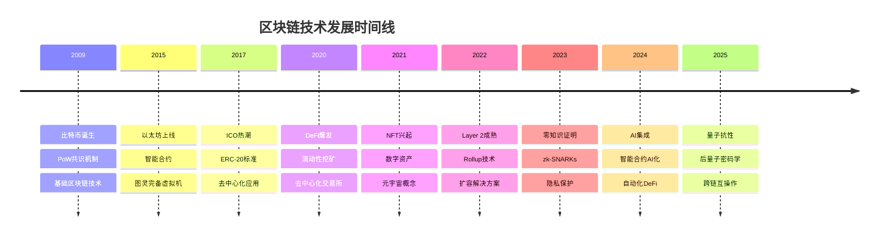

# 区块链新兴技术趋势 2025

## 📋 目录

- [区块链新兴技术趋势 2025](#区块链新兴技术趋势-2025)
  - [📋 目录](#-目录)
  - [1. 2025年技术趋势概览](#1-2025年技术趋势概览)
    - [1.1 技术发展时间线](#11-技术发展时间线)
    - [1.2 2025年重点技术领域](#12-2025年重点技术领域)
  - [2. 零知识证明技术](#2-零知识证明技术)
    - [2.1 zk-SNARKs技术栈](#21-zk-snarks技术栈)
    - [2.2 主流实现方案](#22-主流实现方案)
      - [2.2.1 Groth16](#221-groth16)
      - [2.2.2 PLONK](#222-plonk)
      - [2.2.3 zk-STARKs](#223-zk-starks)
    - [2.3 Rust实现示例](#23-rust实现示例)
  - [3. Layer 2扩容方案](#3-layer-2扩容方案)
    - [3.1 Rollup技术](#31-rollup技术)
      - [3.1.1 Optimistic Rollup](#311-optimistic-rollup)
      - [3.1.2 zk-Rollup](#312-zk-rollup)
    - [3.2 状态通道](#32-状态通道)
    - [3.3 侧链技术](#33-侧链技术)
  - [4. 跨链互操作技术](#4-跨链互操作技术)
    - [4.1 跨链协议](#41-跨链协议)
      - [4.1.1 IBC (Inter-Blockchain Communication)](#411-ibc-inter-blockchain-communication)
      - [4.1.2 XCMP (Cross-Chain Message Passing)](#412-xcmp-cross-chain-message-passing)
    - [4.2 跨链桥技术](#42-跨链桥技术)
      - [4.2.1 锁定-铸造模式](#421-锁定-铸造模式)
      - [4.2.2 原子交换](#422-原子交换)
  - [5. 量子抗性密码学](#5-量子抗性密码学)
    - [5.1 量子计算威胁](#51-量子计算威胁)
    - [5.2 后量子密码学](#52-后量子密码学)
      - [5.2.1 格密码学](#521-格密码学)
      - [5.2.2 基于编码的密码学](#522-基于编码的密码学)
      - [5.2.3 多变量密码学](#523-多变量密码学)
    - [5.3 Rust实现示例](#53-rust实现示例)
  - [6. AI与区块链融合](#6-ai与区块链融合)
    - [6.1 智能合约AI化](#61-智能合约ai化)
    - [6.2 区块链AI训练](#62-区块链ai训练)
    - [6.3 Rust实现示例](#63-rust实现示例)
  - [7. 绿色区块链技术](#7-绿色区块链技术)
    - [7.1 能耗问题](#71-能耗问题)
    - [7.2 绿色共识机制](#72-绿色共识机制)
      - [7.2.1 权益证明 (PoS)](#721-权益证明-pos)
      - [7.2.2 委托权益证明 (DPoS)](#722-委托权益证明-dpos)
      - [7.2.3 实用拜占庭容错 (PBFT)](#723-实用拜占庭容错-pbft)
    - [7.3 可再生能源集成](#73-可再生能源集成)
    - [7.4 碳中和技术](#74-碳中和技术)
  - [8. 隐私计算技术](#8-隐私计算技术)
    - [8.1 同态加密](#81-同态加密)
    - [8.2 安全多方计算](#82-安全多方计算)
    - [8.3 零知识证明](#83-零知识证明)
  - [9. 去中心化身份](#9-去中心化身份)
    - [9.1 DID (去中心化标识符)](#91-did-去中心化标识符)
    - [9.2 VC (可验证凭证)](#92-vc-可验证凭证)
    - [9.3 SSI (自主身份)](#93-ssi-自主身份)
  - [10. 物联网区块链](#10-物联网区块链)
    - [10.1 IoT区块链架构](#101-iot区块链架构)
    - [10.2 轻量级共识](#102-轻量级共识)
    - [10.3 边缘计算集成](#103-边缘计算集成)
  - [11. 总结](#11-总结)

## 1. 2025年技术趋势概览

### 1.1 技术发展时间线



### 1.2 2025年重点技术领域

| 技术领域 | 成熟度 | 市场影响 | 技术挑战 | 发展前景 |
|----------|--------|----------|----------|----------|
| **零知识证明** | 高 | 极高 | 计算复杂度 | ⭐⭐⭐⭐⭐ |
| **Layer 2扩容** | 高 | 高 | 安全性证明 | ⭐⭐⭐⭐⭐ |
| **跨链互操作** | 中 | 高 | 信任机制 | ⭐⭐⭐⭐ |
| **量子抗性** | 中 | 中 | 性能优化 | ⭐⭐⭐⭐ |
| **AI集成** | 低 | 极高 | 技术融合 | ⭐⭐⭐⭐⭐ |
| **绿色区块链** | 中 | 高 | 性能平衡 | ⭐⭐⭐⭐ |
| **隐私计算** | 中 | 高 | 计算开销 | ⭐⭐⭐⭐ |
| **去中心化身份** | 中 | 中 | 标准化 | ⭐⭐⭐ |
| **物联网集成** | 低 | 中 | 设备限制 | ⭐⭐⭐ |

## 2. 零知识证明技术

### 2.1 zk-SNARKs技术栈

**定义 2.1** (zk-SNARKs): 零知识简洁非交互式知识论证，允许证明者向验证者证明某个陈述的真实性，而不泄露任何额外信息。

**技术特点**:

- **零知识**: 不泄露任何秘密信息
- **简洁性**: 证明大小固定且小
- **非交互性**: 无需多轮交互
- **知识论证**: 证明者确实知道秘密

**数学基础**:

```text
Setup(1^λ, C) → (pk, vk)
Prove(pk, x, w) → π
Verify(vk, x, π) → {0, 1}
```

### 2.2 主流实现方案

#### 2.2.1 Groth16

**特点**:

- 证明大小最小 (192字节)
- 验证时间最快
- 需要可信设置

**应用场景**:

- 隐私交易
- 身份验证
- 数据完整性证明

#### 2.2.2 PLONK

**特点**:

- 通用可信设置
- 支持任意电路
- 证明大小适中

**应用场景**:

- 通用计算证明
- 跨链验证
- 复杂业务逻辑

#### 2.2.3 zk-STARKs

**特点**:

- 无需可信设置
- 量子抗性
- 证明大小较大

**应用场景**:

- 大规模计算证明
- 长期安全需求
- 透明性要求高的场景

### 2.3 Rust实现示例

```rust
use ark_ec::PairingEngine;
use ark_ff::PrimeField;
use ark_poly::univariate::DensePolynomial;
use ark_poly::DenseUVPolynomial;

/// zk-SNARKs证明系统
pub struct ZkSnarkSystem<E: PairingEngine> {
    pub proving_key: ProvingKey<E>,
    pub verifying_key: VerifyingKey<E>,
}

impl<E: PairingEngine> ZkSnarkSystem<E> {
    /// 生成证明
    pub fn prove(
        &self,
        public_inputs: &[E::Fr],
        private_inputs: &[E::Fr],
    ) -> Proof<E> {
        // 构造约束系统
        let constraints = self.build_constraints(public_inputs, private_inputs);
        
        // 生成证明
        let rng = &mut rand::thread_rng();
        let r = E::Fr::rand(rng);
        let s = E::Fr::rand(rng);
        
        // 计算证明元素
        let a = self.compute_a_element(&constraints, r);
        let b = self.compute_b_element(&constraints, s);
        let c = self.compute_c_element(&constraints, r, s);
        
        Proof { a, b, c }
    }
    
    /// 验证证明
    pub fn verify(&self, proof: &Proof<E>, public_inputs: &[E::Fr]) -> bool {
        // 配对检查
        let pairing_check = E::pairing(proof.a, proof.b) == 
            E::pairing(self.verifying_key.alpha_g1, self.verifying_key.beta_g2) *
            E::pairing(proof.c, self.verifying_key.gamma_g2);
        
        // 公共输入检查
        let public_input_check = self.verify_public_inputs(proof, public_inputs);
        
        pairing_check && public_input_check
    }
}
```

## 3. Layer 2扩容方案

### 3.1 Rollup技术

**定义 3.1** (Rollup): Rollup是一种Layer 2扩容方案，将交易数据发布到主链，但计算在链下执行。

**技术分类**:

#### 3.1.1 Optimistic Rollup

**工作原理**:

1. 交易在链下执行
2. 状态根提交到主链
3. 7天挑战期
4. 欺诈证明机制

**优势**:

- 兼容性好
- 开发简单
- 成本低

**劣势**:

- 退出时间长
- 需要监控节点
- 安全性依赖挑战机制

#### 3.1.2 zk-Rollup

**工作原理**:

1. 交易在链下执行
2. 生成零知识证明
3. 证明提交到主链
4. 即时验证

**优势**:

- 即时退出
- 高安全性
- 无需挑战期

**劣势**:

- 计算复杂度高
- 开发难度大
- 成本较高

### 3.2 状态通道

**定义 3.2** (状态通道): 状态通道允许参与者在链下进行多次交互，只在最终状态提交到主链。

**技术特点**:

- **即时确认**: 链下交易即时生效
- **低成本**: 减少链上交易费用
- **隐私保护**: 链下交易不公开
- **双向支付**: 支持双向资金流动

### 3.3 侧链技术

**定义 3.3** (侧链): 侧链是独立的区块链，通过双向锚定与主链连接。

**技术特点**:

- **独立性**: 独立的共识机制
- **互操作性**: 与主链双向通信
- **可定制性**: 支持自定义功能
- **风险隔离**: 侧链故障不影响主链

## 4. 跨链互操作技术

### 4.1 跨链协议

#### 4.1.1 IBC (Inter-Blockchain Communication)

**定义 4.1** (IBC): IBC是Cosmos生态的跨链通信协议。

**工作原理**:

1. 轻客户端验证
2. 中继器转发消息
3. 证明验证
4. 状态更新

**技术特点**:

- **安全性**: 基于密码学证明
- **通用性**: 支持任意区块链
- **可扩展性**: 支持多链网络

#### 4.1.2 XCMP (Cross-Chain Message Passing)

**定义 4.2** (XCMP): XCMP是Polkadot的跨链消息传递协议。

**工作原理**:

1. 平行链间直接通信
2. 中继链验证
3. 消息路由
4. 状态同步

**技术特点**:

- **共享安全**: 中继链提供安全保证
- **异构支持**: 支持不同共识机制
- **可扩展性**: 支持100+平行链

### 4.2 跨链桥技术

#### 4.2.1 锁定-铸造模式

**工作原理**:

1. 资产锁定在源链
2. 在目标链铸造等量资产
3. 销毁目标链资产
4. 解锁源链资产

**安全风险**:

- 单点故障
- 中心化风险
- 智能合约漏洞

#### 4.2.2 原子交换

**工作原理**:

1. 哈希时间锁合约
2. 原子性保证
3. 无需信任第三方
4. 点对点交换

**技术特点**:

- **去中心化**: 无需中介
- **安全性**: 密码学保证
- **隐私性**: 链下协商

## 5. 量子抗性密码学

### 5.1 量子计算威胁

**定义 5.1** (量子威胁): 量子计算机对经典密码学的威胁主要来自Shor算法和Grover算法。

**威胁分析**:

- **Shor算法**: 破解RSA、ECC等基于数论的密码学
- **Grover算法**: 将哈希函数安全性减半
- **时间线**: 预计10-20年内出现实用量子计算机

### 5.2 后量子密码学

#### 5.2.1 格密码学

**定义 5.2** (格密码学): 基于格问题的密码学方案。

**核心问题**:

- **最短向量问题** (SVP)
- **最近向量问题** (CVP)
- **学习错误问题** (LWE)

**优势**:

- 量子抗性
- 同态加密支持
- 效率较高

#### 5.2.2 基于编码的密码学

**定义 5.3** (基于编码的密码学): 基于纠错码问题的密码学方案。

**核心问题**:

- **一般解码问题** (GDP)
- **同步解码问题** (SDP)

**优势**:

- 长期安全性
- 标准化程度高
- 实现相对简单

#### 5.2.3 多变量密码学

**定义 5.4** (多变量密码学): 基于多变量多项式方程组的密码学方案。

**核心问题**:

- **多变量二次方程组** (MQ)
- **不平衡油醋签名** (UOV)

**优势**:

- 快速计算
- 小密钥大小
- 硬件友好

### 5.3 Rust实现示例

```rust
use pqcrypto_traits::kem::{PublicKey, SecretKey, SharedSecret};
use pqcrypto_kyber::kyber1024::*;

/// 后量子密钥封装机制
pub struct PostQuantumKEM {
    pub public_key: PublicKey,
    pub secret_key: SecretKey,
}

impl PostQuantumKEM {
    /// 生成密钥对
    pub fn generate_keypair() -> Self {
        let (public_key, secret_key) = keypair();
        Self {
            public_key,
            secret_key,
        }
    }
    
    /// 封装共享密钥
    pub fn encapsulate(&self) -> (Vec<u8>, SharedSecret) {
        encapsulate(&self.public_key)
    }
    
    /// 解封装共享密钥
    pub fn decapsulate(&self, ciphertext: &[u8]) -> SharedSecret {
        decapsulate(ciphertext, &self.secret_key)
    }
}

/// 后量子数字签名
use pqcrypto_dilithium::dilithium5::*;

pub struct PostQuantumSignature {
    pub public_key: PublicKey,
    pub secret_key: SecretKey,
}

impl PostQuantumSignature {
    /// 生成签名密钥对
    pub fn generate_keypair() -> Self {
        let (public_key, secret_key) = keypair();
        Self {
            public_key,
            secret_key,
        }
    }
    
    /// 签名消息
    pub fn sign(&self, message: &[u8]) -> Vec<u8> {
        sign(message, &self.secret_key)
    }
    
    /// 验证签名
    pub fn verify(&self, message: &[u8], signature: &[u8]) -> bool {
        open(signature, message, &self.public_key).is_ok()
    }
}
```

## 6. AI与区块链融合

### 6.1 智能合约AI化

**定义 6.1** (AI智能合约): 集成人工智能功能的智能合约。

**技术特点**:

- **机器学习模型**: 在链上部署ML模型
- **自动化决策**: 基于AI的自动执行
- **预测分析**: 数据驱动的预测功能
- **自适应机制**: 根据环境变化自动调整

**应用场景**:

- **DeFi**: 自动做市商优化
- **NFT**: 动态定价机制
- **游戏**: 智能NPC行为
- **预测市场**: 基于AI的预测

### 6.2 区块链AI训练

**定义 6.2** (去中心化AI训练): 利用区块链技术进行分布式AI模型训练。

**技术方案**:

- **联邦学习**: 分布式数据训练
- **激励机制**: 贡献者获得奖励
- **数据隐私**: 保护训练数据隐私
- **模型验证**: 确保模型质量

### 6.3 Rust实现示例

```rust
use candle_core::{Device, Tensor};
use candle_nn::{linear, Linear, Module};

/// 链上机器学习模型
pub struct OnChainMLModel {
    pub layers: Vec<Linear>,
    pub device: Device,
}

impl OnChainMLModel {
    /// 创建新的ML模型
    pub fn new(input_size: usize, hidden_size: usize, output_size: usize) -> Self {
        let device = Device::Cpu;
        let layers = vec![
            linear(input_size, hidden_size, &device).unwrap(),
            linear(hidden_size, output_size, &device).unwrap(),
        ];
        
        Self { layers, device }
    }
    
    /// 前向传播
    pub fn forward(&self, input: &Tensor) -> Result<Tensor, Box<dyn std::error::Error>> {
        let mut x = input.clone();
        
        for (i, layer) in self.layers.iter().enumerate() {
            x = layer.forward(&x)?;
            if i < self.layers.len() - 1 {
                x = x.relu()?;
            }
        }
        
        Ok(x)
    }
    
    /// 预测
    pub fn predict(&self, input: &[f32]) -> Result<Vec<f32>, Box<dyn std::error::Error>> {
        let input_tensor = Tensor::new(input, &self.device)?;
        let output = self.forward(&input_tensor)?;
        let predictions = output.to_vec1::<f32>()?;
        Ok(predictions)
    }
}

/// 智能合约AI集成
pub struct AISmartContract {
    pub model: OnChainMLModel,
    pub contract_state: ContractState,
}

impl AISmartContract {
    /// 执行AI驱动的交易
    pub fn execute_ai_transaction(&mut self, input_data: &[f32]) -> Result<TransactionResult, ContractError> {
        // 使用AI模型进行预测
        let prediction = self.model.predict(input_data)?;
        
        // 基于预测结果执行交易
        let transaction = self.generate_transaction(&prediction)?;
        
        // 更新合约状态
        self.contract_state.update(&transaction)?;
        
        Ok(TransactionResult {
            transaction,
            prediction,
            timestamp: chrono::Utc::now(),
        })
    }
}
```

## 7. 绿色区块链技术

### 7.1 能耗问题

**问题分析**:

- **PoW能耗**: 比特币年耗电量超过某些国家
- **环境影响**: 大量碳排放
- **资源浪费**: 计算资源用于无意义的工作
- **可持续性**: 长期发展不可持续

### 7.2 绿色共识机制

#### 7.2.1 权益证明 (PoS)

**能耗优势**:

- 能耗降低99.9%
- 无需挖矿设备
- 减少电子垃圾
- 降低碳排放

**技术特点**:

- 基于权益选择验证者
- 经济激励机制
- 长期安全性
- 可扩展性更好

#### 7.2.2 委托权益证明 (DPoS)

**能耗优势**:

- 预选验证者减少通信开销
- 确定性出块时间
- 高效能比
- 可预测的能耗

#### 7.2.3 实用拜占庭容错 (PBFT)

**能耗优势**:

- 无挖矿过程
- 确定性共识
- 低计算开销
- 高效能比

### 7.3 可再生能源集成

**技术方案**:

- **太阳能挖矿**: 使用太阳能供电
- **风能利用**: 风电场直接供电
- **水电挖矿**: 利用水电资源
- **储能系统**: 可再生能源储能

### 7.4 碳中和技术

**实现方案**:

- **碳抵消**: 购买碳信用额度
- **植树造林**: 投资环保项目
- **清洁能源**: 使用可再生能源
- **能效优化**: 提高系统能效

## 8. 隐私计算技术

### 8.1 同态加密

**定义 8.1** (同态加密): 允许在密文上直接进行计算，结果解密后与在明文上计算的结果相同。

**数学定义**:

```text
Dec(sk, Eval(pk, f, Enc(pk, m₁), ..., Enc(pk, mₙ))) = f(m₁, ..., mₙ)
```

**技术分类**:

- **部分同态**: 支持特定运算
- **全同态**: 支持任意计算
- **层次同态**: 支持有限次运算

### 8.2 安全多方计算

**定义 8.2** (安全多方计算): 多个参与方在不泄露各自输入的情况下，共同计算某个函数。

**技术特点**:

- **隐私保护**: 输入数据不泄露
- **正确性**: 计算结果正确
- **公平性**: 所有参与方获得结果
- **鲁棒性**: 容忍部分恶意参与方

### 8.3 零知识证明

**应用场景**:

- **隐私交易**: 隐藏交易金额和地址
- **身份验证**: 证明身份而不泄露信息
- **数据完整性**: 证明数据未被篡改
- **合规证明**: 证明合规性而不泄露细节

## 9. 去中心化身份

### 9.1 DID (去中心化标识符)

**定义 9.1** (DID): 去中心化标识符是一种新型的全球唯一标识符，不依赖于任何中央注册机构。

**技术特点**:

- **去中心化**: 不依赖中央机构
- **自主控制**: 用户完全控制身份
- **互操作性**: 跨平台使用
- **隐私保护**: 最小化信息泄露

### 9.2 VC (可验证凭证)

**定义 9.2** (VC): 可验证凭证是数字化的凭证，包含关于主体的声明，可以被验证。

**技术特点**:

- **可验证性**: 可以验证真实性
- **选择性披露**: 只披露必要信息
- **可撤销性**: 支持凭证撤销
- **互操作性**: 跨系统使用

### 9.3 SSI (自主身份)

**定义 9.3** (SSI): 自主身份是一种数字身份模式，个人或组织完全控制自己的数字身份。

**核心原则**:

- **自主控制**: 用户控制身份数据
- **可移植性**: 身份数据可携带
- **互操作性**: 跨系统使用
- **最小化披露**: 只披露必要信息

## 10. 物联网区块链

### 10.1 IoT区块链架构

**定义 10.1** (IoT区块链): 将区块链技术应用于物联网设备，实现设备间的可信交互。

**技术特点**:

- **设备身份**: 每个设备有唯一身份
- **数据完整性**: 确保数据未被篡改
- **自动化交易**: 设备间自动交易
- **去中心化**: 无需中央控制

### 10.2 轻量级共识

**技术需求**:

- **低能耗**: 适合IoT设备
- **快速确认**: 实时响应需求
- **简单实现**: 资源受限设备
- **安全性**: 保证系统安全

**实现方案**:

- **PoA**: 权威证明
- **DPoS**: 委托权益证明
- **BFT**: 拜占庭容错
- **混合共识**: 多种机制结合

### 10.3 边缘计算集成

**技术方案**:

- **边缘节点**: 就近处理数据
- **本地共识**: 减少网络延迟
- **数据过滤**: 只上传重要数据
- **智能缓存**: 提高响应速度

## 11. 总结

2025年区块链技术发展呈现以下趋势：

1. **零知识证明**: 成为隐私保护的核心技术
2. **Layer 2扩容**: 解决区块链可扩展性问题
3. **跨链互操作**: 实现多链生态互联
4. **量子抗性**: 应对量子计算威胁
5. **AI集成**: 智能合约AI化趋势明显
6. **绿色技术**: 可持续发展成为重点
7. **隐私计算**: 保护数据隐私的同时支持计算
8. **去中心化身份**: 用户自主控制数字身份
9. **物联网集成**: 区块链与IoT深度融合

这些技术趋势将推动区块链技术向更加成熟、安全、高效、环保的方向发展。

---

**文档版本**: v1.0.0  
**最后更新**: 2025年10月15日  
**作者**: 区块链技术趋势分析师  
**审核**: 新兴技术专家
