# 区块链技术知识图谱 2025

## 📋 目录

- [1. 知识图谱概览](#1-知识图谱概览)
- [2. 核心概念关系](#2-核心概念关系)
- [3. 技术栈关系](#3-技术栈关系)
- [4. 学习路径图](#4-学习路径图)
- [5. 依赖关系图](#5-依赖关系图)
- [6. 实现层次图](#6-实现层次图)
- [7. 安全模型图](#7-安全模型图)
- [8. 性能优化图](#8-性能优化图)

## 1. 知识图谱概览

### 1.1 整体架构

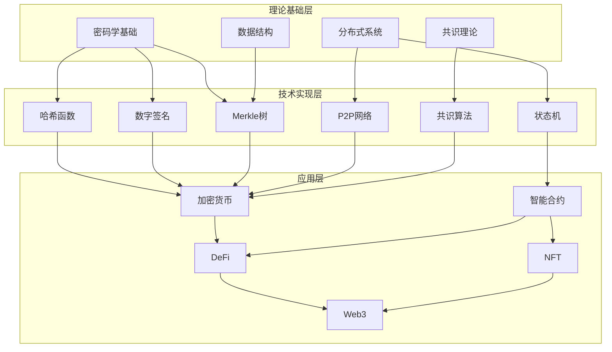

### 1.2 知识域划分

| 知识域 | 核心概念 | 关键技术 | 应用场景 |
|--------|----------|----------|----------|
| **密码学** | 哈希、签名、加密 | SHA-256, ECDSA, AES | 数据完整性、身份验证 |
| **分布式系统** | 一致性、容错、网络 | P2P, BFT, Gossip | 去中心化、高可用 |
| **共识机制** | 一致性、安全性 | PoW, PoS, PBFT | 状态同步、防双花 |
| **数据结构** | 链式结构、树结构 | 区块链, Merkle树 | 数据组织、验证 |
| **智能合约** | 图灵完备、状态 | EVM, WASM | 自动化执行、DeFi |
| **扩容技术** | 分层、分片、侧链 | Layer2, Sharding | 性能提升、成本降低 |

## 2. 核心概念关系

### 2.1 区块链核心概念图

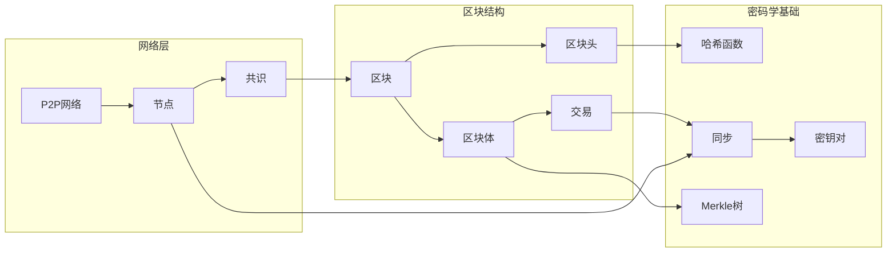

### 2.2 概念依赖关系

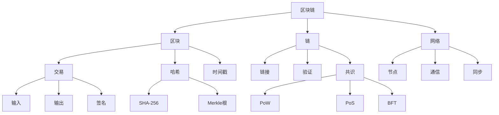

## 3. 技术栈关系

### 3.1 完整技术栈

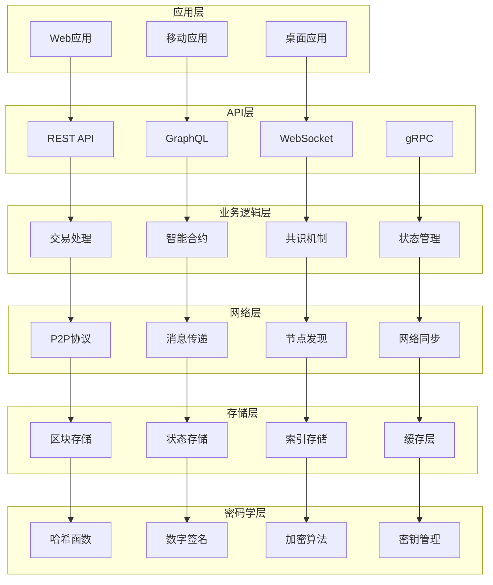

### 3.2 Rust技术栈

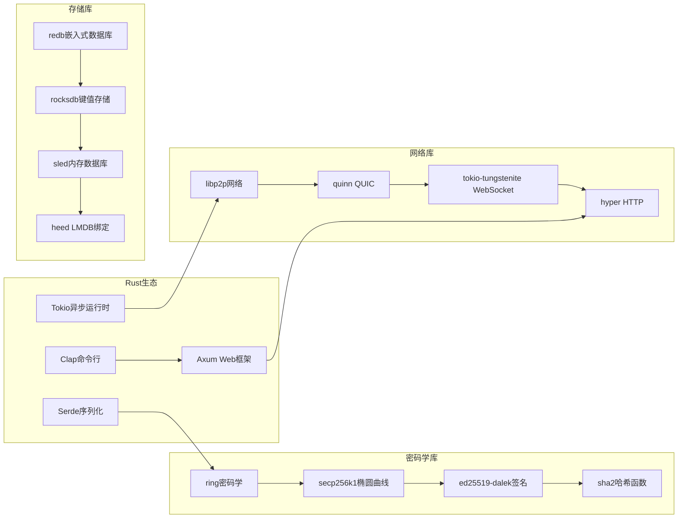

## 4. 学习路径图

### 4.1 初学者路径

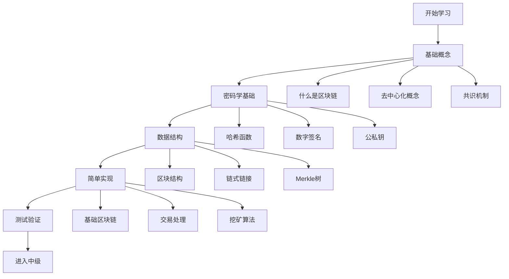

### 4.2 中级开发者路径

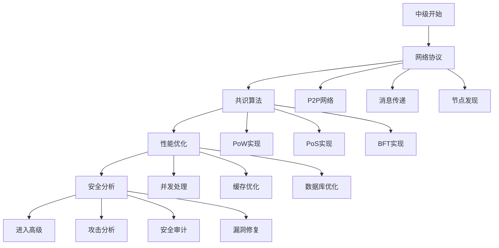

### 4.3 高级专家路径

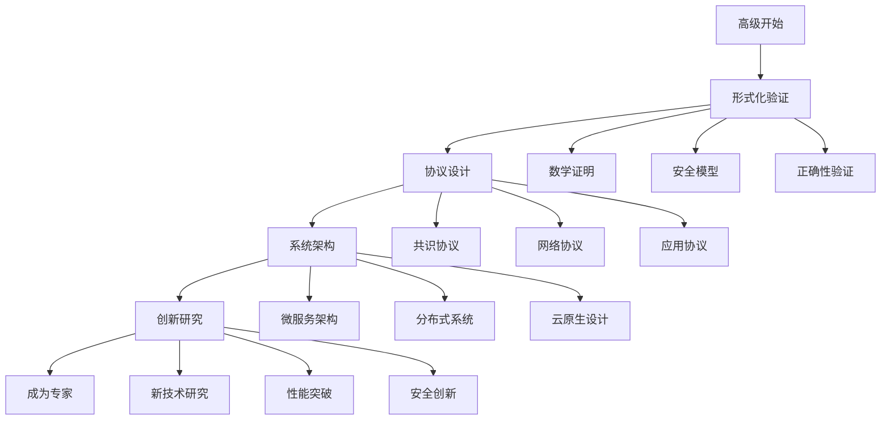

## 5. 依赖关系图

### 5.1 模块依赖关系

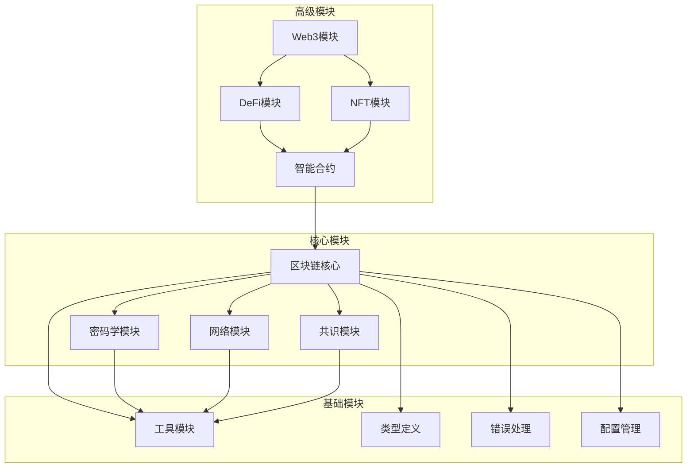

### 5.2 库依赖关系

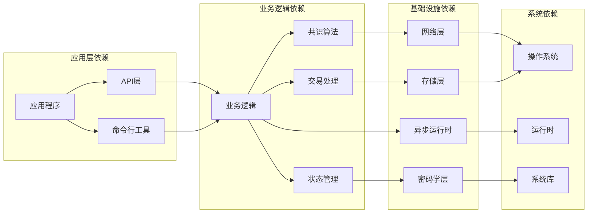

## 6. 实现层次图

### 6.1 系统架构层次

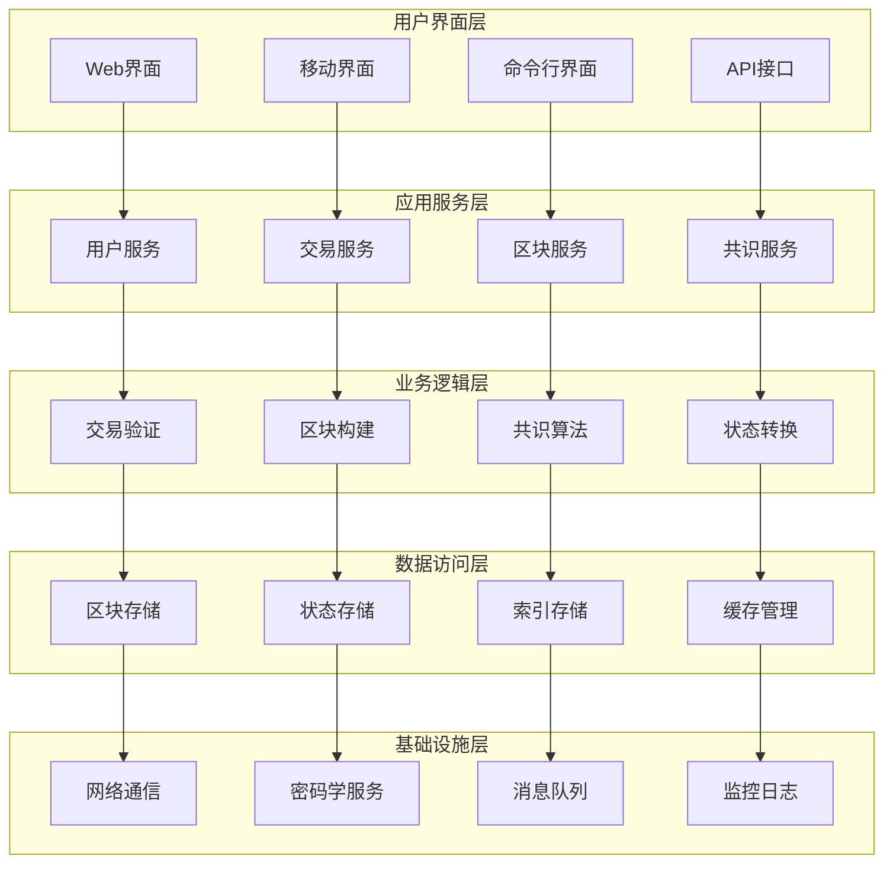

### 6.2 数据流层次

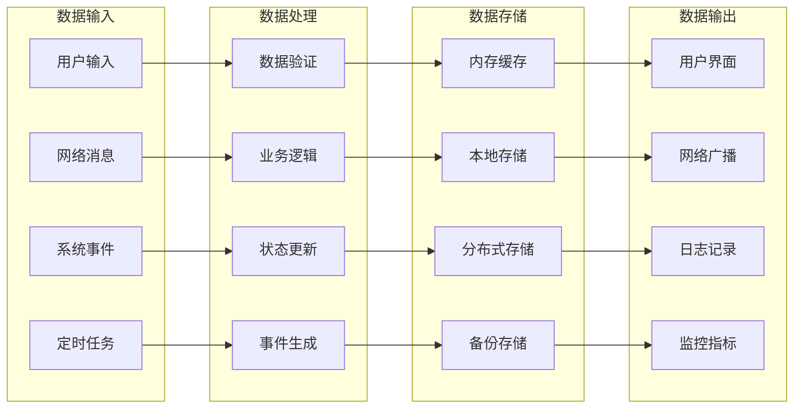

## 7. 安全模型图

### 7.1 威胁模型

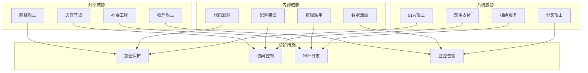

### 7.2 安全边界

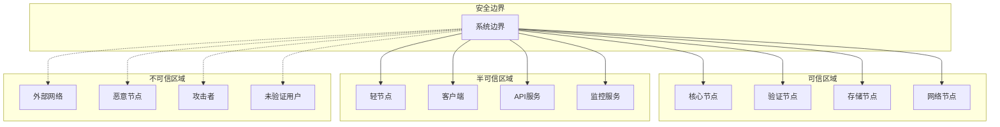

## 8. 性能优化图

### 8.1 性能瓶颈分析

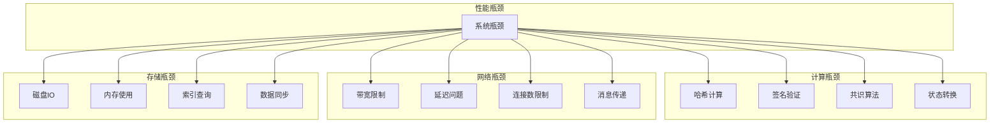

### 8.2 优化策略

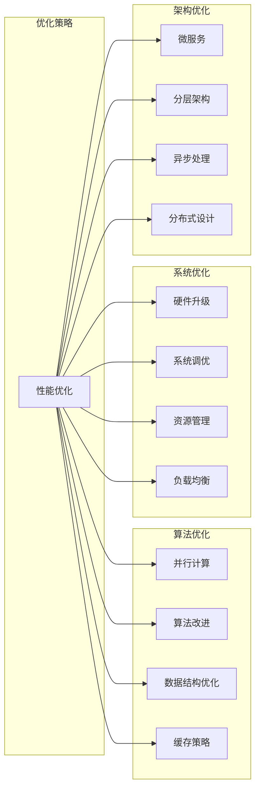

## 9. 知识图谱应用

### 9.1 学习路径规划

基于知识图谱，可以为不同背景的学习者规划个性化的学习路径：

**计算机科学背景**:

1. 分布式系统理论 → 共识机制 → 区块链实现
2. 密码学基础 → 数字签名 → 区块链安全
3. 数据结构 → Merkle树 → 区块链存储

**金融背景**:

1. 区块链概念 → 加密货币 → DeFi应用
2. 智能合约 → 金融协议 → 风险管理
3. 监管合规 → 隐私保护 → 企业应用

**工程背景**:

1. 系统架构 → 性能优化 → 生产部署
2. 网络协议 → P2P通信 → 分布式系统
3. 数据库设计 → 状态管理 → 数据一致性

### 9.2 技术选型指导

知识图谱可以帮助开发者做出技术选型决策：

**共识机制选择**:

- 公链应用 → PoW/PoS
- 联盟链应用 → BFT/DPoS
- 高性能需求 → DPoS/Avalanche
- 高安全性需求 → PoW/BFT

**存储方案选择**:

- 高性能需求 → 内存数据库
- 大容量需求 → 分布式存储
- 一致性需求 → 关系数据库
- 灵活性需求 → 文档数据库

**网络协议选择**:

- 公网环境 → libp2p
- 内网环境 → 自定义协议
- 高延迟环境 → QUIC
- 低延迟需求 → UDP

## 10. 区块链技术演进图谱

### 10.1 技术发展时间线

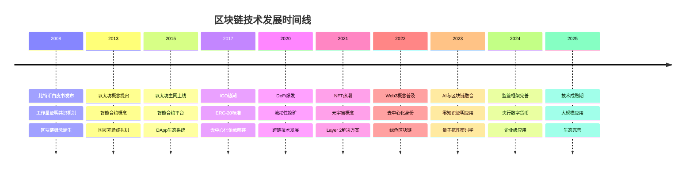

### 10.2 技术栈演进图

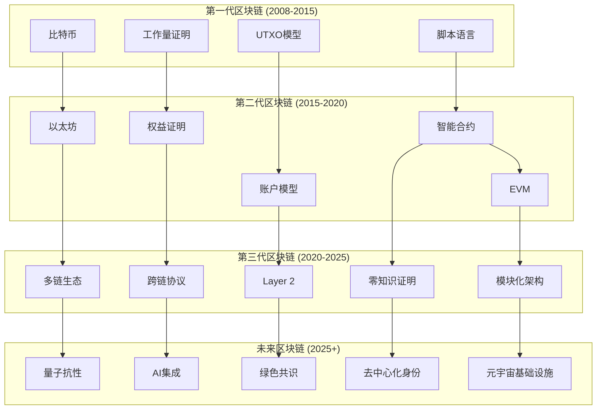

### 10.3 应用场景图谱

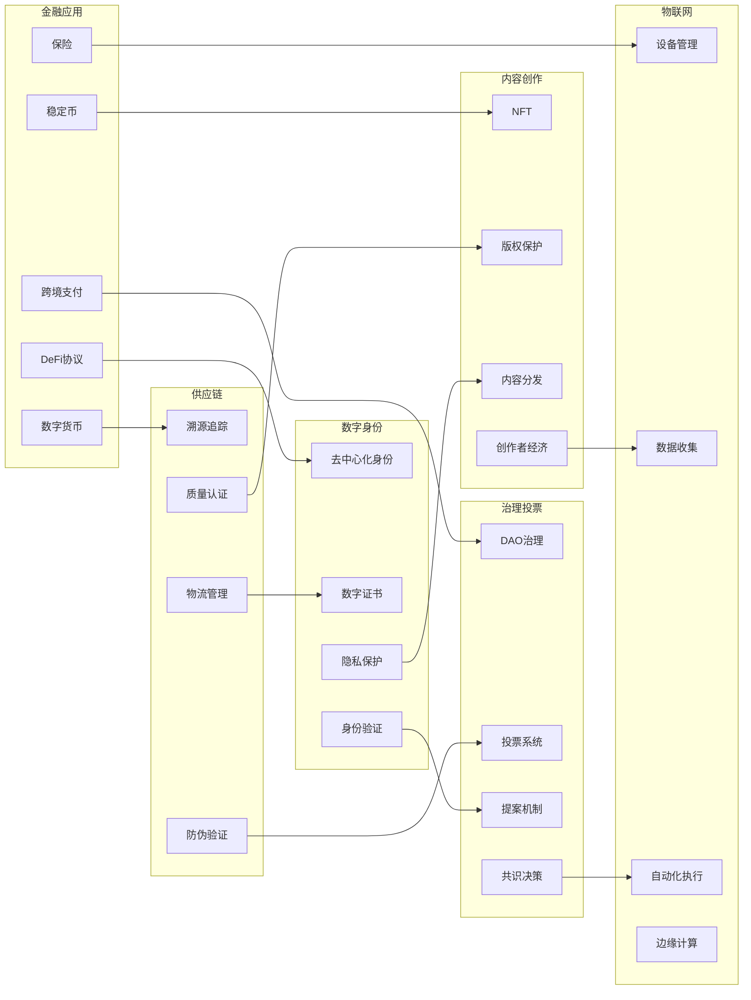

## 11. 知识图谱应用场景

### 11.1 学习路径规划

基于知识图谱的个性化学习路径：

**初学者路径**:

```text
基础概念 → 密码学基础 → 数据结构 → 简单实现 → 测试验证
```

**中级开发者路径**:

```text
深入理论 → 架构设计 → 完整实现 → 标准规范 → 性能优化
```

**高级专家路径**:

```text
形式化验证 → 最佳实践 → 应用开发 → 复杂项目 → 创新研究
```

### 11.2 技术选型指导

**共识机制选择矩阵**:

| 应用场景 | 推荐共识 | 理由 |
|---------|---------|------|
| 公链应用 | PoW/PoS | 去中心化、安全性 |
| 联盟链 | BFT/DPoS | 高性能、确定性 |
| 物联网 | PoA | 低能耗、快速确认 |
| 金融应用 | PBFT | 强一致性、低延迟 |

**存储方案选择**:

| 需求 | 推荐方案 | 特点 |
|------|---------|------|
| 高性能 | 内存数据库 | 快速读写 |
| 大容量 | 分布式存储 | 可扩展性 |
| 一致性 | 关系数据库 | ACID特性 |
| 灵活性 | 文档数据库 | 模式自由 |

### 11.3 风险评估框架

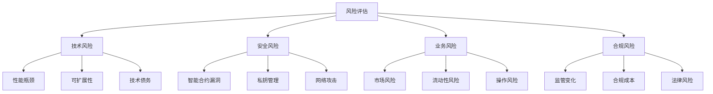

## 12. 总结

本文档提供了区块链技术的完整知识图谱，包括：

1. **概念关系**: 核心概念之间的依赖和关联关系
2. **技术栈**: 完整的技术栈架构和组件关系
3. **学习路径**: 不同层次的学习路径和技能发展
4. **依赖关系**: 模块和库之间的依赖关系
5. **实现层次**: 系统实现的层次结构和数据流
6. **安全模型**: 威胁模型和安全边界
7. **性能优化**: 性能瓶颈分析和优化策略
8. **技术演进**: 技术发展时间线和演进路径
9. **应用场景**: 各种应用场景和技术选择
10. **风险评估**: 全面的风险评估框架

这个知识图谱为区块链技术的学习、研究和应用提供了全面的指导框架，帮助开发者和研究者更好地理解、设计和实现区块链系统。

---

**文档版本**: v1.0.0  
**最后更新**: 2025年10月15日  
**作者**: 区块链技术架构师  
**审核**: 知识图谱专家
