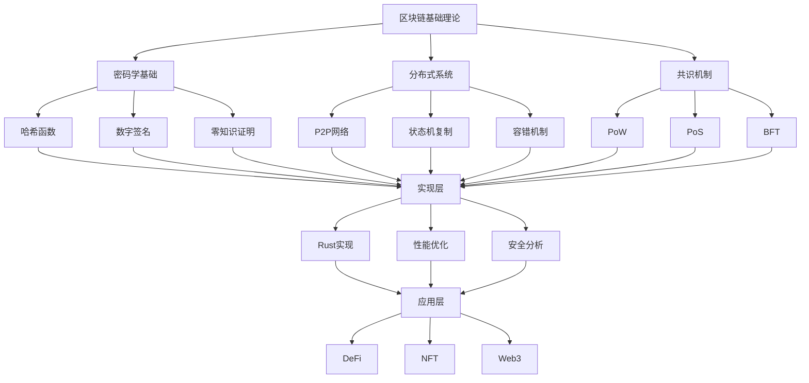

# 区块链技术知识体系主索引 2025

## 📋 文档架构概览

本文档体系基于2025年最新区块链技术趋势，构建了完整的知识图谱和学习路径，包含理论基础、技术实现、形式化证明和实践应用四个层次。

## 🗺️ 知识图谱结构

## 📚 文档分类体系

### 1. 理论基础层 (Theoretical Foundation)

#### 1.1 核心概念定义

- **[01_CORE_CONCEPTS.md](./01_CORE_CONCEPTS.md)** - 区块链核心概念与定义
- **[02_CRYPTOGRAPHIC_FOUNDATIONS.md](./02_CRYPTOGRAPHIC_FOUNDATIONS.md)** - 密码学理论基础
- **[03_DISTRIBUTED_SYSTEMS.md](./03_DISTRIBUTED_SYSTEMS.md)** - 分布式系统理论
- **[04_CONSENSUS_THEORY.md](./04_CONSENSUS_THEORY.md)** - 共识机制理论

#### 1.2 形式化证明

- **[05_FORMAL_VERIFICATION.md](./05_FORMAL_VERIFICATION.md)** - 形式化验证与证明
- **[06_SECURITY_MODELS.md](./06_SECURITY_MODELS.md)** - 安全模型与威胁分析
- **[07_MATHEMATICAL_FOUNDATIONS.md](./07_MATHEMATICAL_FOUNDATIONS.md)** - 数学基础与算法分析

### 2. 技术实现层 (Technical Implementation)

#### 2.1 架构设计

- **[08_ARCHITECTURE_DESIGN.md](./08_ARCHITECTURE_DESIGN.md)** - 系统架构设计
- **[09_NETWORK_PROTOCOLS.md](./09_NETWORK_PROTOCOLS.md)** - 网络协议设计
- **[10_STORAGE_SYSTEMS.md](./10_STORAGE_SYSTEMS.md)** - 存储系统设计
- **[11_PERFORMANCE_OPTIMIZATION.md](./11_PERFORMANCE_OPTIMIZATION.md)** - 性能优化策略

#### 2.2 Rust实现

- **[12_RUST_IMPLEMENTATION.md](./12_RUST_IMPLEMENTATION.md)** - Rust语言实现
- **[13_CRYPTO_IMPLEMENTATION.md](./13_CRYPTO_IMPLEMENTATION.md)** - 密码学实现
- **[14_CONSENSUS_IMPLEMENTATION.md](./14_CONSENSUS_IMPLEMENTATION.md)** - 共识算法实现
- **[15_NETWORK_IMPLEMENTATION.md](./15_NETWORK_IMPLEMENTATION.md)** - 网络层实现

### 3. 标准规范层 (Standards & Specifications)

#### 3.1 国际标准

- **[16_INTERNATIONAL_STANDARDS.md](./16_INTERNATIONAL_STANDARDS.md)** - 国际标准体系
- **[17_INDUSTRY_STANDARDS.md](./17_INDUSTRY_STANDARDS.md)** - 行业标准规范
- **[18_PROTOCOL_SPECIFICATIONS.md](./18_PROTOCOL_SPECIFICATIONS.md)** - 协议规范详解

#### 3.2 最佳实践

- **[19_SECURITY_BEST_PRACTICES.md](./19_SECURITY_BEST_PRACTICES.md)** - 安全最佳实践
- **[20_DEVELOPMENT_GUIDELINES.md](./20_DEVELOPMENT_GUIDELINES.md)** - 开发指导原则
- **[21_TESTING_STRATEGIES.md](./21_TESTING_STRATEGIES.md)** - 测试策略与方法

### 4. 应用实践层 (Applications & Practice)

#### 4.1 应用场景

- **[22_DEFI_APPLICATIONS.md](./22_DEFI_APPLICATIONS.md)** - 去中心化金融应用
- **[23_NFT_ECOSYSTEM.md](./23_NFT_ECOSYSTEM.md)** - NFT生态系统
- **[24_WEB3_TECHNOLOGIES.md](./24_WEB3_TECHNOLOGIES.md)** - Web3技术栈
- **[25_ENTERPRISE_SOLUTIONS.md](./25_ENTERPRISE_SOLUTIONS.md)** - 企业级解决方案

#### 4.2 实践项目

- **[26_HANDS_ON_PROJECTS.md](./26_HANDS_ON_PROJECTS.md)** - 实践项目指南
- **[27_CASE_STUDIES.md](./27_CASE_STUDIES.md)** - 案例分析
- **[28_TROUBLESHOOTING.md](./28_TROUBLESHOOTING.md)** - 问题诊断与解决

## 🎯 学习路径指南

### 初学者路径 (Beginner Path)

1. **理论基础** → 01-04
2. **基础实现** → 12-13
3. **简单项目** → 26

### 中级开发者路径 (Intermediate Path)

1. **深入理论** → 05-07
2. **架构设计** → 08-11
3. **完整实现** → 14-15
4. **标准规范** → 16-18

### 高级专家路径 (Expert Path)

1. **形式化验证** → 05-07
2. **最佳实践** → 19-21
3. **应用开发** → 22-25
4. **复杂项目** → 27-28

## 🔬 研究方法论

### 理论研究方法

- **形式化建模** - 使用数学语言描述系统
- **逻辑推理** - 基于公理和规则的严格推导
- **安全分析** - 威胁模型和攻击向量分析
- **性能分析** - 复杂度理论和基准测试

### 实验验证方法

- **原型实现** - 概念验证和可行性研究
- **基准测试** - 性能评估和对比分析
- **安全审计** - 代码审查和漏洞扫描
- **压力测试** - 极限条件下的系统行为

## 📊 知识评估体系

### 理论掌握度评估

- **概念理解** - 核心概念的定义和解释
- **原理分析** - 技术原理的深入理解
- **数学推导** - 形式化证明和计算
- **系统思维** - 整体架构和组件关系

### 实践能力评估

- **代码实现** - 功能完整性和代码质量
- **性能优化** - 效率提升和资源利用
- **问题解决** - 调试能力和故障排除
- **创新应用** - 新技术应用和方案设计

## 🌐 技术趋势跟踪

### 2025年重点技术

- **零知识证明** - zk-SNARKs, zk-STARKs
- **Layer 2扩容** - Rollups, State Channels
- **跨链互操作** - IBC, XCMP, Bridge Protocols
- **量子抗性** - 后量子密码学
- **绿色共识** - 环保共识机制

### 新兴研究方向

- **AI与区块链融合** - 智能合约AI化
- **物联网集成** - IoT设备区块链化
- **隐私计算** - 同态加密, 安全多方计算
- **去中心化身份** - DID, VC, SSI
- **可持续性** - ESG合规, 碳中和

## 🔗 外部资源链接

### 学术资源

- **顶级会议** - IEEE S&P, ACM CCS, NDSS
- **期刊论文** - IEEE TIFS, ACM TOS, Springer LNCS
- **研究机构** - MIT, Stanford, ETH Zurich

### 行业资源

- **技术标准** - ISO, IEEE, W3C, IETF
- **开源项目** - Bitcoin, Ethereum, Polkadot
- **开发工具** - Truffle, Hardhat, Substrate

### 教育资源

- **在线课程** - Coursera, edX, Udacity
- **技术文档** - 官方文档, 技术博客
- **社区论坛** - Stack Overflow, Reddit, Discord

## 📈 持续更新计划

### 月度更新

- 技术趋势跟踪
- 新标准发布
- 安全漏洞报告
- 性能基准更新

### 季度更新

- 架构设计优化
- 实现方案改进
- 最佳实践更新
- 案例研究补充

### 年度更新

- 知识体系重构
- 学习路径调整
- 评估标准更新
- 资源链接维护

---

**文档版本**: v2.0.0  
**最后更新**: 2025年10月15日  
**维护团队**: Rust区块链技术团队  
**联系方式**: [GitHub Issues](https://github.com/rust-lang/blockchain/issues)
